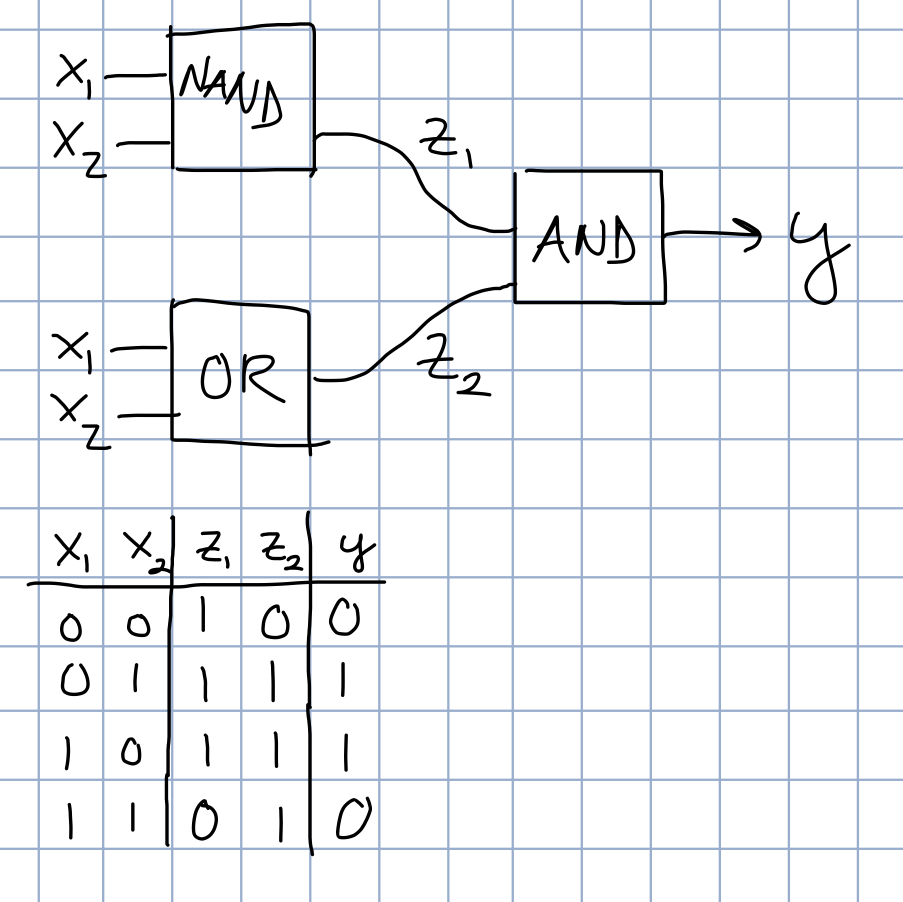

### Module 10 Exercises | Joshua Shapiro | 20 June 2017

3. CODE: For the point problem:
    * Create 10 training points from one of the distributions.
    * Compile and upload NullClassifier and click the "train" button.
    * Next, examine the code in NullClassifier. How does the screen output correspond to the generated data?

* **I used a uniform distribution, generating 2 classes with 5 points each. NullClassifier doesn't train, it simply outputs the training data to the screen. It does this by iterating over each class and for each point it prints the x and y coordinates. The code is set in a way that if an object has more than 2 attributes, it will print all of them.**

4. CODE: Consider the char problem:
    * How would the data for a single char be represented as a d-dimensional point?
    * Examine the code in CharProblem.java and identify the manner by which the samples are constructed from line-segments. Where in the code is this being done?
    * Find a place in the code to print out the dimension d for each test sample (which you create on the right side). What is a typical value of d? What kind of character data will have large d?

* **If looking at a character as an image, each pixel could be a dimension, and the value could be 1 or 0, for colored or empty. This of course poses issues if the letters aren't always written in the same size or centered.**
* **In the case of the actual code, a character is defined by a collection of line segments making it up. Each line segment consists of its start x and y value as well as its end x and y value. This means that different samples of letters will have different dimension sizes.**
* **When a letter is drawn or loaded into CharProblem.java, CharProblem.java calls CharFeatures.extractSet. This iterates over every segment, extracting beginning and end coordinates. These coordinates are then added to a vector representing the "letter sample".**

5. CODE: Similarly, what is the size of d for the face problem? Add code to FaceProblem.java to print out these sizes. Is d the same for all samples?

* **The size of d is 36,000 and is the same for each sample. This is because each feature corresponds to the grayscale value of a single pixel, and each image is 200 x 180 pixels. The code to print the size is in FaceProblem.getTrainingData().**

6. Which of the three applications we've seen has this problem?

* **The character classifier has samples of different dimensional size.**

7. For the point example (see the picture above) with M = 7:
    * What is $x^{(3)}$?
    * What is $x_1^{(3)}$?
    * What is $y^{(3)}$?

* **Assuming we are counting points starting with the blue group, and the blue group is labeled class 0...**
  * **$x^{(3)}$ = (2.99,3.47)**
  * **$x_1^{(3)}$ = 2.99 (this assumes there is no $x_0$)**
  * **$y^{(3)}$ = 0**

8. CODE: Download (into the classifierJar directory) and modify NearestNeighbor.java to implement the Nearest-Neighbor algorithm.
    * Try it on the point problem for various numbers of generated points, and for different distributions.
    * Can you create a test point that makes it fail?
    * Apply the algorithm to the char problem. Why doesn't it work?

  * **If the test point is between the two distributions and it happens to be closer to the wrong class, it will be classified incorrectly.**
  * **This is not useful to the char problem because the letters are drawn at different orientations, scales, and locations. These variances make nearest neighbor work poorly when looking at line segment beginnings and endings.**

9. What is the running time of K-Nearest-Neighbor in terms of M, the number of training samples, and K? Does d matter in the running time? What data structure is most appropriate for this computation?

* **If you store the K nearest neighbors in a priority queue with the priority being the largest distance, for each training point only one comparison would need to be made instead of K (you only have to check to see if the current distance is < the largest distance currently in the priority queue). To remove the element in the priority queue has a time complexity of O(logN). To add a value to the priority queue also has a time complexity of O(logN). On the off chance all of our points are given to us from farthest away to closest (so at each step we must remove and add to the priority queue), the run time is as follows: O(M*2*log(K) + K). The + K comes from calculating the majority after running through everything. A larger d will slightly increase the running time, since it requires more operations when calculating euclidean distance.**

10. Consider a database of $10^6$ greyscale images each of size 0.1 megabytes. For K = 10, what is the number of arithmetic operations (say, multiplications) for a single classification?

* **Assuming each pixel is one dimension of our vector, and a pixel takes up 1 byte, each image has about 100 dimensions. For an n-dimensional vector, euclidean distance calculations require n multiplications (not counting the square root). Since we will have to compare the distance of a given sample to every image in our training data, this results in 1,000,000 distance calculations. Each calculation requires 100 multiplications, yielding 100,000,000 multiplications. K has no bearing on how many distance calculations must be performed.**

11. CODE: Download, compile, and execute SimpleNN.java. You will also need DataGenerator.java.
    * Examine SimpleNN to confirm that is implements the Nearest-Neighbor algorithm for samples that come out of DataGenerator.
    * What is the probability of error?
    * Change the < to <= in the if condition at the end of classify(). What is the probability of error?
    * Explain why there's such a big difference.

* **The probability of error when < is 0.24.**
* **The probability of error when <= is 0.135.**
* **DataGenerator only generates a point in class 0 40% of the time. This means that there will be more points in class 1 and a greater likelihood that the closest distance is to class 1. By making = still return class 0, we minimize the issue with a larger distribution of points coming from class 1.**

12. CODE: Download DataExample.java and execute. You will also need DataGenerator.java and RandTool.java. Write code to estimate the probability that data is generated from class 0. What is the probability that the data comes from class 1?

* **The probability that the data comes from class 1 is 76.66%.**

13. CODE: Add code to estimate Pr[X = 3|C = 0] and Pr[X = 3|C = 1].
    * Why is it that the sum of these two does not equal 1? Which equation does result in 1?
    * If you were given a test sample x = 3 which of the two classes would you think it likely came from?

* **When K = 30, Pr[X = 3|C = 0] = 0. Pr[X = 3|C = 1] = 0.696.**
* **The sum does not equal 1 because 3 is not the only possible outcome when c = 0 or 1. The equation that does result in 1 is Pr[C = 0|X = 3]+Pr[C = 1|X = 3].**
* **If given a test sample where x = 3, I would assume it came from class 1.**

14. CODE: Write down the conditional pmf Pr[X = m|C = 1] by examining the code in DataGenerator.

* **Pr[X = 0|C = 1] = 0**
* **Pr[X = 1|C = 1] = 0.05**
* **Pr[X = 2|C = 1] = 0.1**
* **Pr[X = 3|C = 1] = 0.6**
* **Pr[X = 4|C = 1] = 0.1**
* **Pr[X = 5|C = 1] = 0.15**

15. CODE: Implement the algorithm in DataExample2.java, which has the code for evaluation. Try a different algorithm to see if the error improves.

* **Pr[E]=0.13099. If the classify code chose 0 or 1 based on their respective probabilities for 1, 2, and 3, there is a chance that the accuracy would increase. However, the classifier then has the ability to classify the same point in different classes, which is not what we want.**

16. CODE: Copy the algorithm over to DataExample3.java, which estimates the error when x = 3.
    * What is the error?
    * Next, change Pr[C = 0] (which is now 0.4) to 0.9. What is the error now?
    * How would you change the algorithm to improve the error?

* **The error is Pr[E3]=0.09967510726420475.**
* **The error when Pr[C=0] = 0.9 is Pr[E3]=0.5937170010559663.**
* **Instead of hard coding which class to return given the x value, I'd have the classifier itself determine the probabilities based on the training data.**

17. For the case x = 3, compute Pr[X = x|C = 0]Pr[C = 0] and Pr[X = x|C = 1]Pr[C = 1] by hand when Pr[C = 0] = 0.4. Then, compute both when Pr[C = 0] = 0.9.

* **When Pr[C = 0] = 0.4:**
    * **Pr[X = 3|C = 0]Pr[C = 0] = 0.1 * 0.4 = 0.004**
    * **Pr[X = 3|C = 1]Pr[C = 1] = 0.6 * 0.6 = 0.36**
    * **When Pr[C = 0] = 0.9:**
    * **Pr[X = 3|C = 0]Pr[C = 0] = 0.1 * 0.9 = 0.09**
    * **Pr[X = 3|C = 1]Pr[C = 1] = 0.6 * 0.1 = 0.06**

19. Why isn't E differentiable with respect to $w_i$?

* **E is not continuous, so it is not differentiable.**

20. Why?

* **E is now differentiable because it is a continuous function.**

23. CODE: Download and add code to Sigmoid.java to compute and display the sigmoid function in the range [-10,10]. You will also need Function.java and SimplePlotPanel.java. How could you make it approximate a step function even more closely?

* **If you multiply -x in the denominator by a constant, the sigmoid will look more like a step function.**

25. Determine weights for each of the three units above so that the result achieves the XOR function. Then, build a truth table and show how the combination results in computing XOR.

* ****
* **The given explanation makes more sense with the image above.**
* **The equation of line 1 is $2x_1 + 2x_2 = 1$. This produces a classification function $f_1(x_1,x_2) = 2x_1 + 2x_2 - 1$. The weights for this function are as follows: $w_1 = 2, w_2 = 2, w_3 = -1$. This is effectively an "or" classifier.**
* **The equation of line 2 is $-2x_1 - 2x_2 = 3$. This produces a classification function $f_2(x_1,x_2) = -2x_1 - 2x_2 + 3$. The weights for this function are as follows: $w_1 = -2, w_2 = -2, w_3 = 3$. This is effectively a "nand" classifier.**
* **Using the outputs of classification function 1 as $x_2$ and the output of classification function 2 as $x_1$ (in order to match the picture in the class notes), we can use a final classification function $f_3(x_1,x_2) = x_1 + x_2 - 1$. The weights for this function are as follows: $w_1 = w_2 = 1, w_3 = -1$. This is effectively an "and" classifier (assuming points on the line are classified as 0).**
* **The Truth table is shown below:**
* ****
