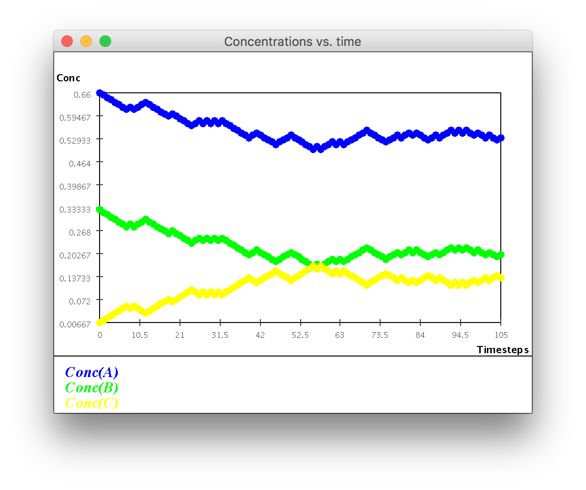
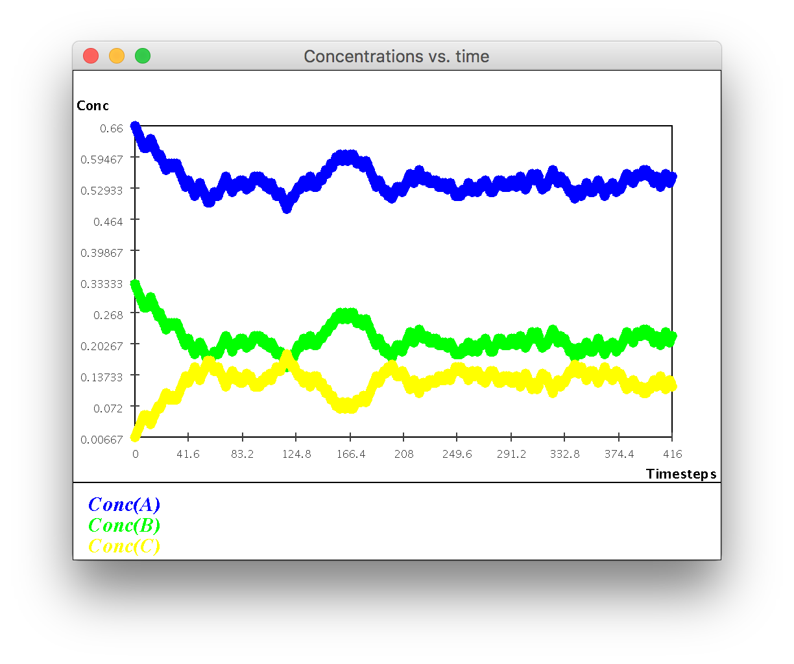
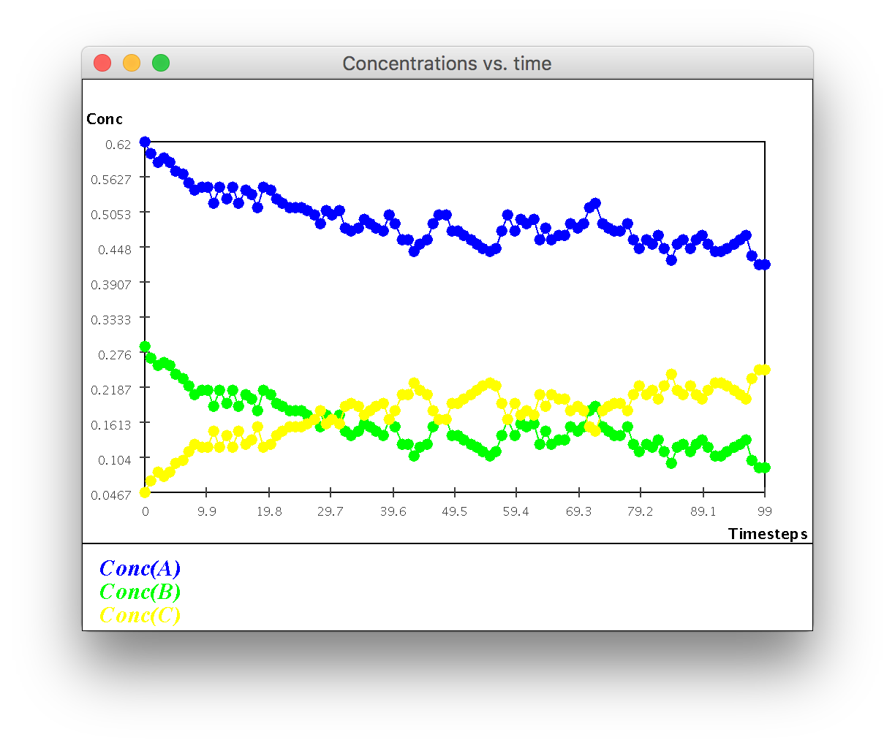
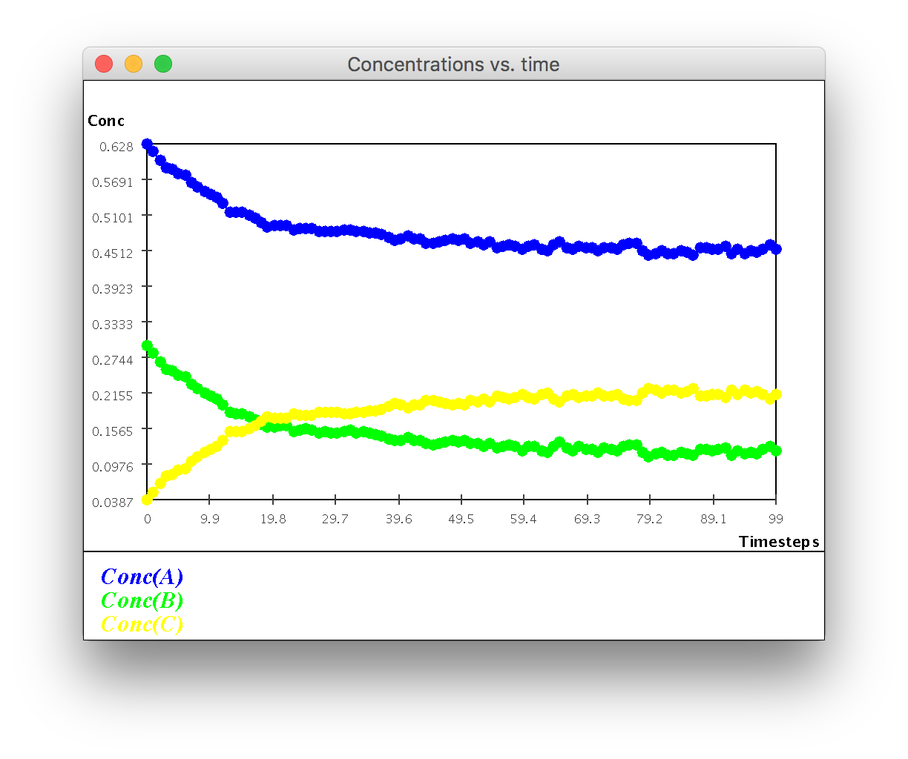
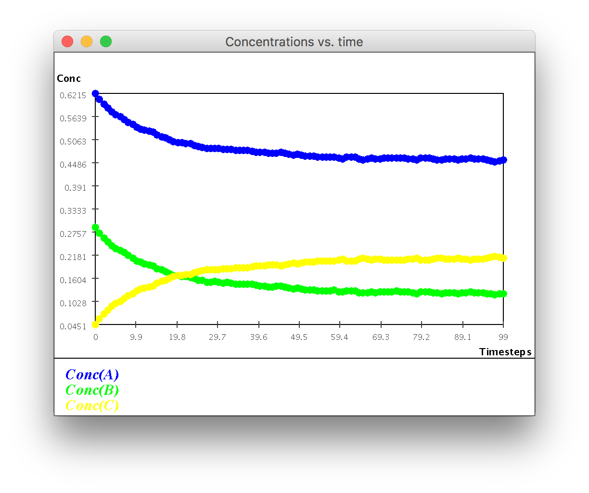
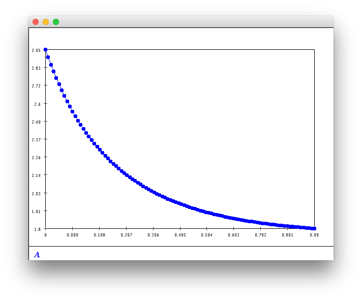
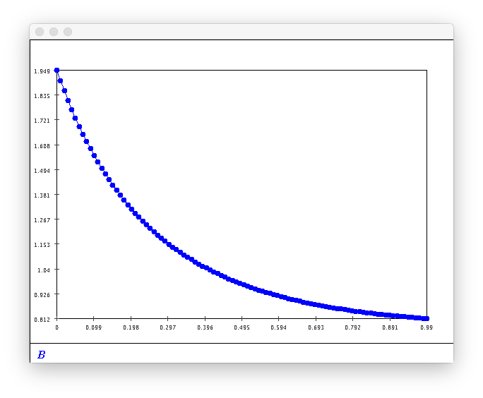
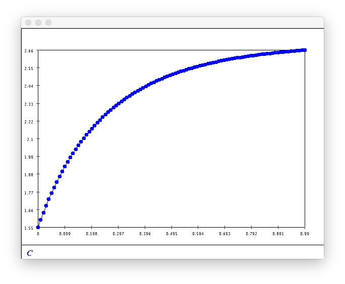
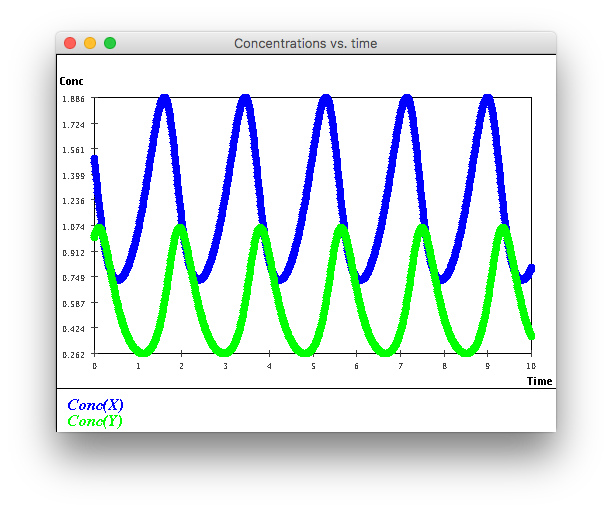

### Module 4 Exercises | Joshua Shapiro | 30 March 2017

1. CODE: Download and unpack this zip file into a new directory. upon unpacking, you will see that it creates a new subdirectory called VirtualReactor. Go into that subdirectory, then compile and execute the VirtualReactor.java file. This will bring up a window. Here's what you do:
    * Note that the Model menu offers you the choice of different models. Select the first one: standard simulation.
    * In the section entitled "Initial numbers of molecules" enter 100 in the box for A, 50 in the box for B, and 0 for C. Then click "Change" in the same row.
    * Hit the Reset button in the "Animation" section.
    * Then hit the "Go" button, and simulate until the time shows about 100 (this is in the rightmost label of the "Stats" section).
    * About time 100, hit "Stop" and then "Plot". You should see the time-evolution of the concentrations of each of A, B and C.
    * ****
    * Finally, compare how long it takes to simulate 100 time units when there are large numbers of molecules (10000 of A, 5000 of B, 0 of C).
    * **It takes much longer to simulate time units when there are a large number of molecules.**

2. Suppose you have ten A molecules and five B molecules.
    * Compute the concentrations (by hand) of A and B using the reasoning above.
    * **Concentrations:**
        * $E_a = N_a/V_{total} = 10/15 = 0.667$
        * $E_b = N_b/V_{total} = 5/15 = 0.333$
        * $E_c = 0$
    * Now run the simulation very slowly by clicking on the "Step" button. (Note: Each time you start, remember to hit the "Reset" button.) How long before you see the second reaction taking place?
    * **The second reaction (C -> A + B) takes place at t = 3**
    * Just after you see the second reaction taking place for the first time, re-compute (by hand) the concentrations and verify that they match with the numbers in the "Stats" section.
    * **Concentrations: (they match the numbers in the stats section)**
        * $E_a = N_a/V_{total} = 9/15 = 0.6$
        * $E_b = N_b/V_{total} = 4/15 = 0.267$
        * $E_c = N_c/V_{total} = 1/15 = 0.067$

3. Study the long-term behavior (starting with 100 molecules of A, 50 molecules of B):
    * How long (in time-steps shown) does it take for the concentrations to "settle"?
    * **Around 50 timesteps**
    * Do the concentrations ever stay fixed after a while? Why or why not?
    * **The concentrations settle down but don't stay fixed.**
    * ****
    * What are the final concentrations of A, B, and C, approximately?
    * **Around A=0.553, B=0.22, C=0.113**

4. What is the purpose of uniform() above and how does it ensure that the reactions are selected with appropriate probabilities?
Examine the code in method standard() in MolecularSimPanel.java. What is the relevance of the spatial distance between molecules?

* **Uniform generates a random number. This is then used in tandem with the reaction probabilities to choose if reaction A or B should occur.**
* **Spatial distance between molecules is not taken into account when using the standard simulation, just the probabilities of the reactions are taken into account.**

5. Use the "Model" menu and switch to the spatial model. Using the same numbers of molecules as above, see what happens when you run for about 100 time units and plot.
    * ****
    * What do you observe? Why are there more fluctuations?
    * **Now that molecules have to be close to each other, it makes sense that in different runs there will be more variance.**
    * Next, look at the last row of controls. Set EndTime=100 and NumRuns=10. Then click the "simulate" button. What do you observe?
    * **Since averages are taken, the plot is a bit smoother**
    * ****
    * Try the same with NumRuns=100. What do you see?
    * **The plot is even smoother**
    * ****
    * For comparison, try NumRuns=10 and NumRuns=100 in the standard simulation.
    * **The concentration of C always stays below B when run in the standard simulation, but C is higher than B in the spatial simulation**

6. Fill in the missing number in the table above.

* **Answer:**
    * $average = \frac{0.59 + 0.53 + 0.55}{3} = 0.56$

7. If the spatial model doesn't use concentration, why then is the behavior like the standard model?
Find the place in the code that has the "distance" parameter. What is the distance parameter set at? Double it and see what you get. Can you explain? What is "doubling" the distance equivalent to in terms of using other values for p and q?

* **The behavior is similar since the concentration of the molecules is enough to dictate the probabilities of the reactions. Since concentration is simply how many of each molecule is in a given space, the spatial model simulates just as well as the standard model.**
* **The distance parameter is set at 100. When it is double the concentrations of B and C take around twice as much time to cross over each other in the plot. By increasing distance, it makes the the proportionality of the second reaction is increased and the proportionality of the first reaction is decreased.**

8. Suppose $s = 0.01, K_{ab} = 1.0, K_c = 0.5$ and $A(0) = 3.0, B(0) = 2.0, C(0) = 1.5$. Compute the concentrations of $A(t), B(t), C(t)$ at times $t = 0.01, t = 0.02, t = 0.03$ as follows:
    * First, calculate $A(0.01), B(0.01), C(0.01)$.
    * **Answer:**
        * $A(0.01) = A(0) + s(K_cC(0) - K_{ab}A(0)B(0)) = 3 + 0.01(0.5 * 1.5 - 1 * 3 * 2) = 2.9475$
        * $B(0.01) = B(0) + s(K_cC(0) - K_{ab}A(0)B(0)) = 2 + 0.01(0.5 * 1.5 - 1 * 3 * 2) = 1.9475$
        * $C(0.01) = C(0) + s(K_{ab}A(0)B(0) - K_cC(0)) = 1.5 + 0.01(1 * 3 * 2 - 0.5 * 1.5) = 1.5525$
    * Then, use these values to calculate $A(0.02), B(0.02), C(0.02)$.
    * **Answer:**
        * $A(0.02) = A(0.01) + s(K_cC(0.01) - K_{ab}A(0.01)B(0.01)) = 2.9475 + 0.01(0.5 * 1.5525 - 1 * 2.9475 * 1.9475) = 2.8979$
        * $B(0.02) = B(0.01) + s(K_cC(0.01) - K_{ab}A(0.01)B(0.01)) = 1.9475 + 0.01(0.5 * 1.5525 - 1 * 2.9475 * 1.9475) = 1.8979$
        * $C(0.02) = C(0.01) + s(K_{ab}A(0.01)B(0.01) - K_cC(0.01)) = 1.5525 + 0.01(1 * 2.9475 * 1.9475 - 0.5 * 1.5525) = 1.6021$
    * Then, use the values at 0.02 to calculate $A(0.03), B(0.03), C(0.03)$.
    * **Answer:**
        * $A(0.03) = A(0.02) + s(K_cC(0.02) - K_{ab}A(0.02)B(0.02)) = 2.8979 + 0.01(0.5 * 1.6021 - 1 * 2.8979 * 1.8979) = 2.8509$
        * $B(0.03) = B(0.02) + s(K_cC(0.02) - K_{ab}A(0.02)B(0.02)) = 1.8979 + 0.01(0.5 * 1.6021 - 1 * 2.8979 * 1.8979) = 1.8509$
        * $C(0.03) = C(0.02) + s(K_{ab}A(0.02)B(0.02) - K_cC(0.02)) = 1.6021 + 0.01(1 * 2.8979 * 1.8979 - 0.5 * 1.6021) = 1.6491$

9. CODE: Write a Java program to compute concentrations using this model. Start by using this template. Then, modify the code to change the end-time to 1.0. What do you observe as the final concentrations of A, B and C? Plot a graph of how the concentrations change with time, and compare with previous models.

* **Concentrations at end: A = 1.795, B = 0.812, C = 2.659**
* ****
* ****
* ****

10. CODE: How would one go about writing the code so that it's recursive? That is, our goal is to compute A(T), B(T), C(T) for some large T, which we could do recursively in terms of A(T-s), B(T-s), C(T-s), which in turn can be computed from A(T-2s), B(T-2s), C(T-2s) ... etc. Write a recursive version and compare the number of arithmetic operations in the recursive approach vs. the iterative one.

* **The number of arithmetic operations are the same.**

11. In general, how accurate should a model be? Consider this Physics experiment:
    * Suppose, from atop a 300-foot building on campus you fix a point on a protruding rod where you can drop a heavy (so that wind won't have an effect) object to observe where it lands on the ground.
    * From that same drop-point, you let down a plumb-line and mark the spot where the plumb line touches the ground.
    * Now you drop the heavy object.
    * You expect the dropped object to hit the marked spot dead on, right? Right?
    * Discuss with your neighboring students, whether:
    1. The object hits the marked spot dead-on.
    2. The object lands a little to the West.
    3. The object lands a little to the East.
    4. The object lands a little to the North.
    5. The object lands a little to the South.
    * The answer to this question, it turns out, has had tremendous historical significance.

* **The ball lands to the east due to the momentum from the Earth rotating.**

12. Run the VirtualReactor program and select the "Rabbit-Lynx" model. Use these values: $X(0) = 1.5, Y(0) = 1.0, k_1 = 2.4, k_2 = 4.2, k_3 = 5.1, endTime = 10$. (Ignore the $k_4$ parameter.) You should observe something quite interesting.

* ****

13. Download and execute Missile.java. Examine the code and write down the differential equations. How many variables (functions) are involved?

* **Equations: (3 functions are involved for the missile, 1 function for the target)**
    * $d'_{target}(t) = v_{target}$
    * $x'_{missile}(t) = v_x$
    * $y'_{missile}(t) = v_y$
    * $v'_y(t) = a_y$

14. Why is this true?

15. Why is this true?

16. Write pseudocode for a Dubin car simulator based on these equations.

17. What additional equation is needed for an accelerative version of the Dubin car?

18. CODE: Write down the equations for the Simple-Car which has two controls: forward-velocity $v$ and steering angle $\phi$. Implement a simulator for the Simple-Car in CarSim. (To draw one, merely draw a circle).

19. Why?

20. Download and examine Winch.java.
    * Identify the code corresponding to the differential equations we derived earlier.
    * Handcode different values of torque to see what value is sufficient to lift the load. Is there a value that will lift the load and yet avert a collision with the winch?

21. Set isVertical=false in the program and execute. You should see a version without gravity (as if the load were on a frictionless surface). What value of torque is sufficient to pull the load?
