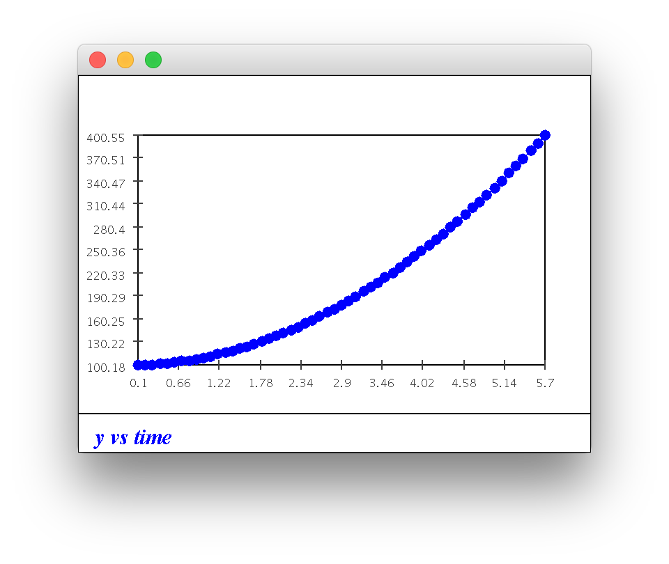
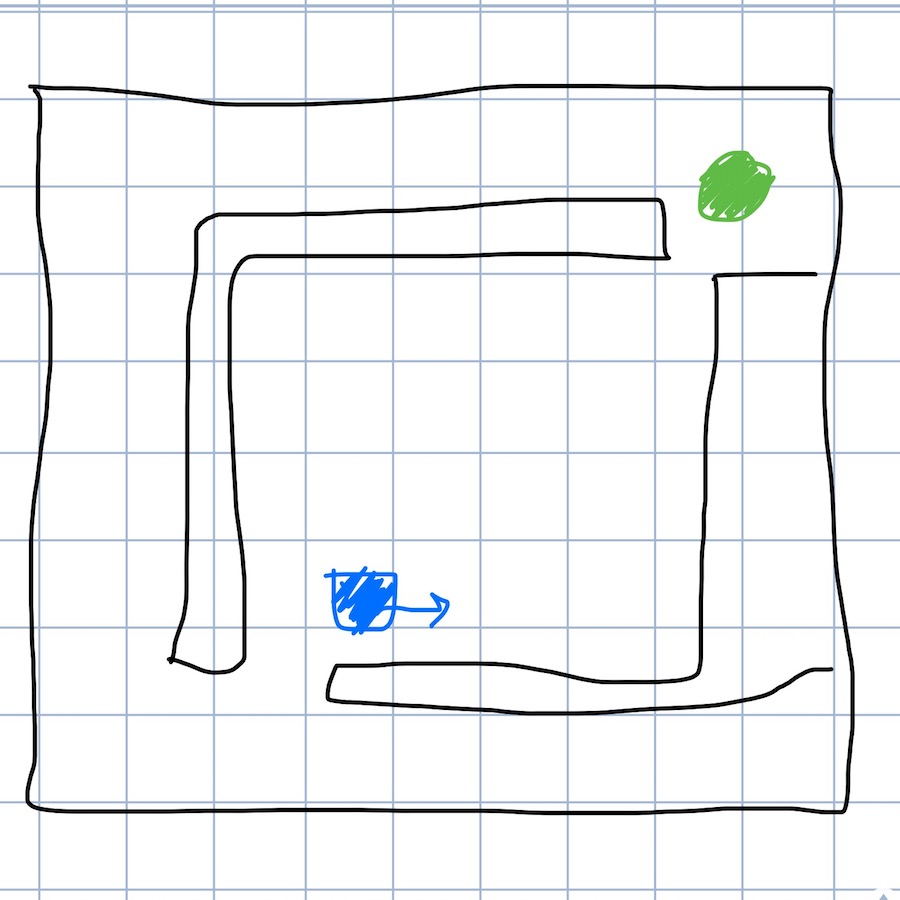

### Module 5 Exercises | Joshua Shapiro | 30 March 2017

1. CODE: Recall the winch example: Winch.java. Try different torque values to lift the load to the desired height. You will also need Function.java and SimplePlotPanel.java. Upon clicking "stop" you will see how the distance y varies with time.

* ****

2. CODE: Implement proportional control for the horizontal case in the nextStep() method of Winch2.java. Experiment with different values of the constant Kp, for example Kp = 5, 10, 50. What do you observe? Where have you seen this dynamic behavior before? What is the value of yMax in the code?

* **When Kp= 5 it is extremely slow, and seems to oscillate after it reaches the goal. As Kp increases the speed increases, but so does the oscillation. This behavior is similar to the behavior of a sine or cosine function. yMax in the code is 250.**

3. CODE: Implement proportional-derivative control for the horizontal case in Winch3.java. Experiment with different values of the constants Kp and Kd. For example: Kd = 10, 100, 1000 (using previous values of Kp). Does any value of Kd fix the problem?

* **Using derivative control allows the oscillation to minimize over time, however it never completely stops oscillating, and it takes a while to minimize. Higher Kd's seemed to have better results, though the Kp had to be increased as well. Kp=500 and Kd=1000 seemed to work well, almost completely stopping oscillation.**

4. CODE: Apply PD-control to the vertical case, writing that version in Winch4.java. Again, experiment with different values of Kp. What do you observe?

* **The Kp has to be higher for the vertical case. Kp=1000 and Kd=500 had promising results.**

5. CODE: Apply PID-control to the vertical case, writing your code in Winch5.java. Experiment with different Ki values.

* **Kp=1000, Kd=700, Ki=15 seemed to work well.**

6. CODE: Download and unpack carSim.jar. Use java CarGUI manual on the command-line to run in manual mode, then select the Unicycle and "basic sensor". Drive around some obstacles (scene-3 or scene-4) and observe how the sensors work.

* **There are 8 "ultrasonic" sensors on the car that provide distances in the N, NE, E, SE, ... directions.**

7. CODE: Examine the file BasicSensorPack.java. You can access the variable sonarDistance[] to get these distances. Here, sonarDistance[0] is the distance in front (North of the vehicle). Next, use this template to write a simple car controller for Scene-3 that goes towards the obstacle, stops just before it and turns left to face North. Don't forget to select "Basic sensor" in carGUI when testing.

* **DONE**

8. CODE: Implement the above algorithm in your controller using $\alpha = 10, \delta = 40$ and a forward velocity of 10, with Scene-3 as the setting. The NE distance is sonarDistance[7] whereas the SE distance is sonarDistance[5] (going anti-clockwise). Recall that we need to set the steering angle $\phi > 0$ to turn left and $\phi < 0$ to turn right. What do you notice when the unicycle tries to turn right at the obstacle corner?

* **The unicycle begins to shake because the NE distance value keeps changing between very large and very small.**

9. CODE: Implement the above algorithm in your controller. Use vel=2 as the reduced speed. Does it solve the problem?

* **It still shakes but since the car is always moving forward it eventually turns the corner.**

10. CODE: Implement proportional control in your controller. Use a small (e.g. vel=2) velocity throughout. Experiment with different values of the proportionality constant Kp. What do you observe when the vehicle turns a corner?

* **It still shakes around the corner but seems to be faster.**

11. CODE: Add derivative control to your controller. Experiment with different values of the two proportionality constants Kp and Kd. What do you observe?

* **Turning through the first corner is smoother, though for the second corner it still shakes and will sometimes turn slightly in the wrong direction due to the oscillation. Still seems faster than without derivative component.**

12. CODE: See if bounding the sensor values (as inputs to the algorithm) makes a difference. Observe what happens as the vehicle turns near the third obstacle corner (near the x-axis, as it's headed down).

* **The oscillations when turning are more pronounced, but it seems that the car is turning faster. I can probably tune the Kd value more to have less pronounced oscillations. As it is heading into the 3rd turn, my car works fine (though has a bit of shaking). However, I could see a situation where the car will crash into the corner since the NE and SE sensors show large distances but the E sensor effectively shows a distance of 0.**

13. CODE: Implement the above algorithm and see if it works. Can you suggest improvements?

* **While this does solve the problem of hitting the obstacle, it causes issues when first turning. Since the same delta is used for North distance and East distance, the first turn results in turning past 90 degrees. This could be solved by using a different delta for East and North. Also, to prevent the shaking, it may be better to average multiple measurements or use more than just the NE and SE sensors for PD control. Also implementing the integral part of PID may help.**

14. CODE: Implement the above in MySimpleCarController2.java and see if it works. What do you observe?

* **It does not work since it never stays in the correct state for more than one move call. This can be solved by using states instead of if/else statements.**

15. CODE: Implement the above algorithm and see if it works.

* **It does, but it never finds the goal again after following an obstacle.**

16. CODE: Implement the above in MySimpleCarController3.java and see if it works. The open-to-goal test has been implemented for you.

* **DONE**

17. How can you determine whether it's closer to turn clockwise vs. anticlockwise?

* **You can use the sensors you are checking distances with to determine which direction to turn. For instance, if openToGoal is checking between E and SE for the goal, then it will be closer to turn clockwise. If openToGoal is checking anything that contains W, then it will be closer to turn counter clockwise.**

18. What happens if we are too close to an obstacle on the left side? What changes are needed for obstacle avoidance on the left?

* **The same planning with the NE and SE sonar should be done with NW and SW to handle obstacle avoidance on the left.**

19. Assuming obstacle avoidance works, draw on paper a scenario on paper where the above goal-seeking algorithm fails to reach the goal. Suggest a better algorithm.

* ****
* **In the above example the car will get to a point where N will never sense a wall and the delta value of W and E will allow the car to try to fit through the gap. The car will not fit and it will crash. A better algorithm would use more sensors, or take averages of the current sensors to detect when there are small openings that the car can't fit through. **
