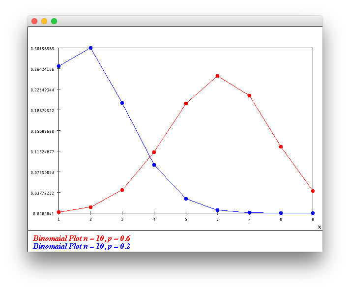

### Module 6 Exercises | Joshua Shapiro | 24 May 2017

5. Suppose Pr[heads] = p in the example above. Write down Pr[X = i], i $\in$ {0,1,2,3}, in terms of p.

* **Answer:**
    * **$Pr[X = 0] = (1-p)^3$**
    * **$Pr[X = 1] = p * (1-p)^2$**
    * **$Pr[X = 2] = p^2 * (1-p)$**
    * **$Pr[X = 3] = p^3$**

8. CODE: If p = 0.6, what is the probability that the first head appears on the 3rd flip? Verify your answer using Coin.java and CoinExample.java.

* **Answer:**
    * **$Pr[X = 3] = (1-p)^2p = (0.4)^2*0.6 = 0.096$. This has been verified in code.**

9. Suppose I compare two parameter values for the Geometric distribution: p = 0.6 and p = 0.8. For which of the two values of p is Pr[X = 3] higher?

* **Answer:**
    * **When p = 0.6: $Pr[X = 3] = (1-p)^2p = (0.4)^2*0.6 = 0.096$**
    * **When p = 0.8: $Pr[X = 3] = (1-p)^2p = (0.2)^2*0.8 = 0.032$**
    * **Pr[X = 3] is higher when the probability of getting heads is lower.**

10. Compute (by hand) Pr[X > k] when X ~ Geometric(p).

* **Answer:**
    * **$Pr[X > k] = 1 - (\sum_{i=1}^{k} Pr[X = i]) = 1 - (\sum_{i=1}^{k} (1-p)^{i-1}p)$**

11. CODE: Suppose we flip a coin n times and count the number of heads using a coin for which Pr[H] = p.
    * Write code to compute Pr[X = k] using the formula $Pr[X = k] = {n \choose k}p^k(1 - p)^{n-k}$. Write your code in Binomial.java.
    * Plot a graph of Pr[X = k] vs. k for the case n = 10, p = 0.6 and for the case n = 10, p = 0.2.
    * Write a simulation to estimate Pr[X = 3] when n = 10, p = 0.6. You can use Coin.java and CoinExample2.java for this purpose. Verify the estimate using the earlier formula.

* **Answer:**
    * ** See BinomialPlot.java for the code.**
    * **The simulation shows Pr[3 H in 10 flips]=0.042469. This matches the code in Binomail.java which produced Pr[3 H in 10 flips]=0.042467328000000006**

13. CODE: Add code to Poisson.java to compute Pr[X = k] and plot a graph of Pr[X = k] vs. k when $\gamma$ = 2. Use the Taylor series for $e^x$ to prove that $\sum_{k}$ Pr[X = k] adds up to 1.

* **Answer:**
    * **$e^x = 1 + x + \frac{x^2}{2!} + \frac{x^3}{3!} + ... + \frac{x^n}{n!} = \sum_{n=0}^{k}\frac{x^n}{n!}$**
    * **$\sum_{i=0}^{k}Pr[X = k] = \sum_{i=0}^{k}e^{-\gamma} * \frac{\gamma^i}{i!} = e^{-\gamma}\sum_{i=0}^{k}\frac{\gamma^i}{i!}$**
    * **As shown on the first bullet, $\sum_{i=0}^{k}\frac{\gamma^i}{i!} = e^\gamma$**
    * **$\implies \sum_{i=0}^{k}Pr[X = k] = e^{-\gamma} * e^\gamma = e^0 = 1  \blacksquare$**

14. CODE: Download BusStop.java and BusStopExample3.java, and modify the latter to estimate the probability that exactly three buses arrive during the interval [0,2]. Compare this with Pr[X = 3] when X ~ Poisson(2).

* **The BusStop yields a result of 0.1796. The Poisson code from 13 yields a result of 0.1804470443154836.**

19. Consider the distribution for the 3-coin-flip example:
    * Pr[X = 0] = 0.064
    * Pr[X = 1] = 0.288
    * Pr[X = 2] = 0.432
    * Pr[X = 3] = 0.216
    * Sketch the CDF on paper.

23. What is an example of a continuous rv associate with the QueueControl.java application?

25. CODE: The program GaussianCDF.java estimates the CDF of a Gaussian rv. Execute the program to plot the CDF. Then, use this CDF to compute the following probabilities:
    * Pr[0 < X $\leq$ 2]
    * Pr[X > 0]

26. CODE: Modify UniformCDF.java and GaussianCDF.java to compute the derivative of each. What is the shape of F'(y) in each case?

27. If X denotes the first interarrival time in the bus-stop problem, estimate the CDF of X as follows:
    * Assume that values fall in the range [0,3] (i.e., disregard values outside this range).
    * Use ExponentialCDF.java as a template, and add modified code from UniformCDF.java
    * Next, compute the derivative of this function and display it.

28. Complete the calculation above. What would you get if Pr[H] = 0.5?

29. How does this relate to the 3-coin-flip example?

31. What does $\frac{n_k}{n}$ become in the limit? Unfold the sum for the 3-coin-flip example to see why this is true.

32. CODE: Download Coin.java and CoinExample3.java and let X = the number of heads in 3 coin flips.
    * Compute the average value of X using $\frac{1}{n}S_n$
    * Estimate Pr[X = k] using $\frac{n_k}{n}$
    * Compute $\sum_{k} k \frac{n_k}{n}$ using the estimate of $\frac{n_k}{n}$
    * Compare with the E[X] calculation you made earlier.

33. CODE: Use Coin.java and CoinExample4.java and let X = the number of flips needed to go get the first heads when Pr[Heads] = 0.1. Compute the average value of X using $\frac{1}{n}S_n$ as you did in the previous exercise. Compare with the E[X] calculation from earlier.

34. CODE: Try this computation with the uniform, Gaussian, and exponential distributions using UniformCDF2.java, GaussianCDF2.java, and ExponentialCDF2.java. Explore what happens when more intervals are used in the expectation computation than in the CDF estimation.

40. CODE: Estimate the density of the time spent in the system by a random customer in the QueueControl example. To do this, you need to build a density histogram of values of the variable timeInSystem in QueueControl.java.

44. Suppose X ~ Exponential($\gamma$) with CDF F(x). Write down an expression for $F^{-1}$(y), the inverse of F.

46. CODE: Add code to DiscreteGenExample.java to implement the above generator, and to test it by building a histogram.

48. CODE: Add code to ExponentialGenerator.java to implement the above idea. Use the inverse-CDF you computed earlier. The test code is written to produce a histogram. Use your modified version of PropHistogram.java to make a density histogram. Compare the result with the actual density (using $\gamma$ = 4). How do you know your code worked?
