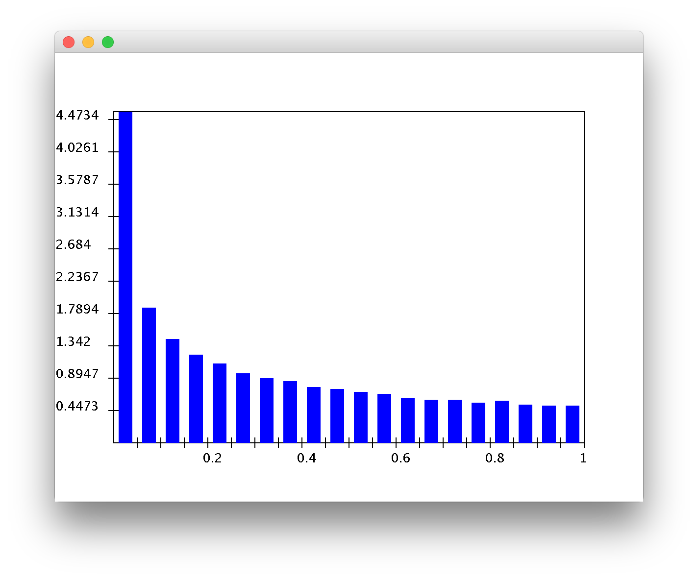
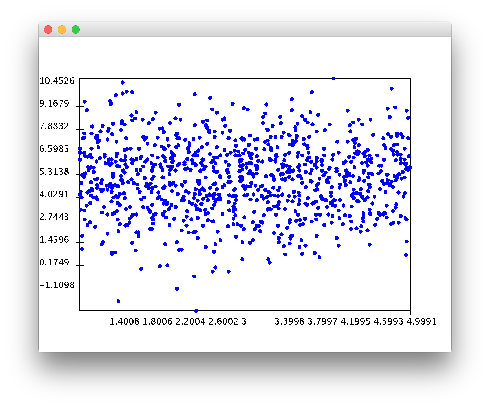
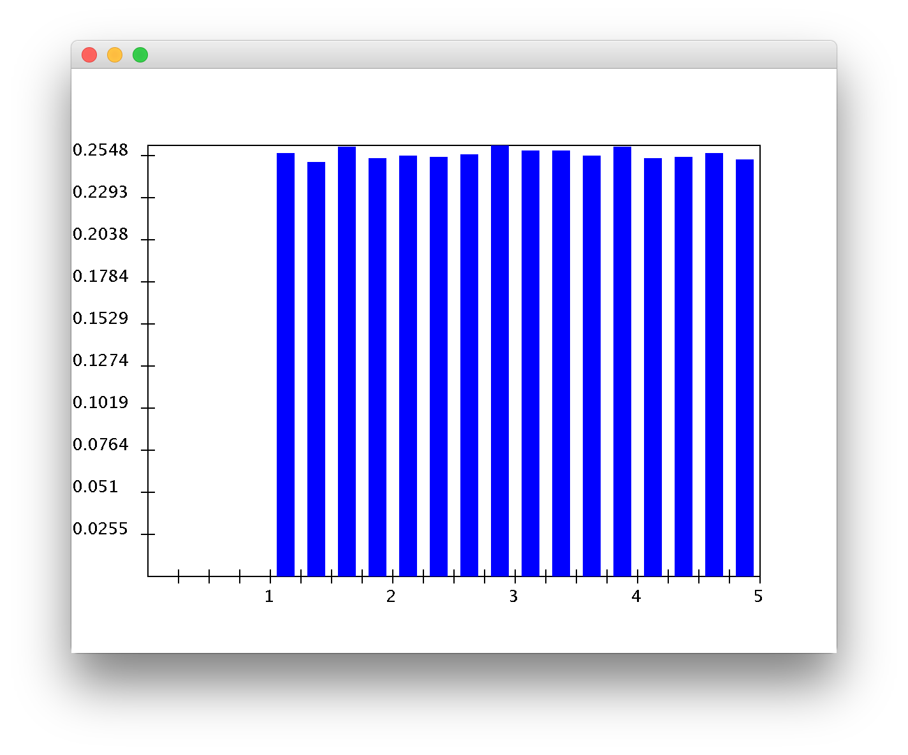
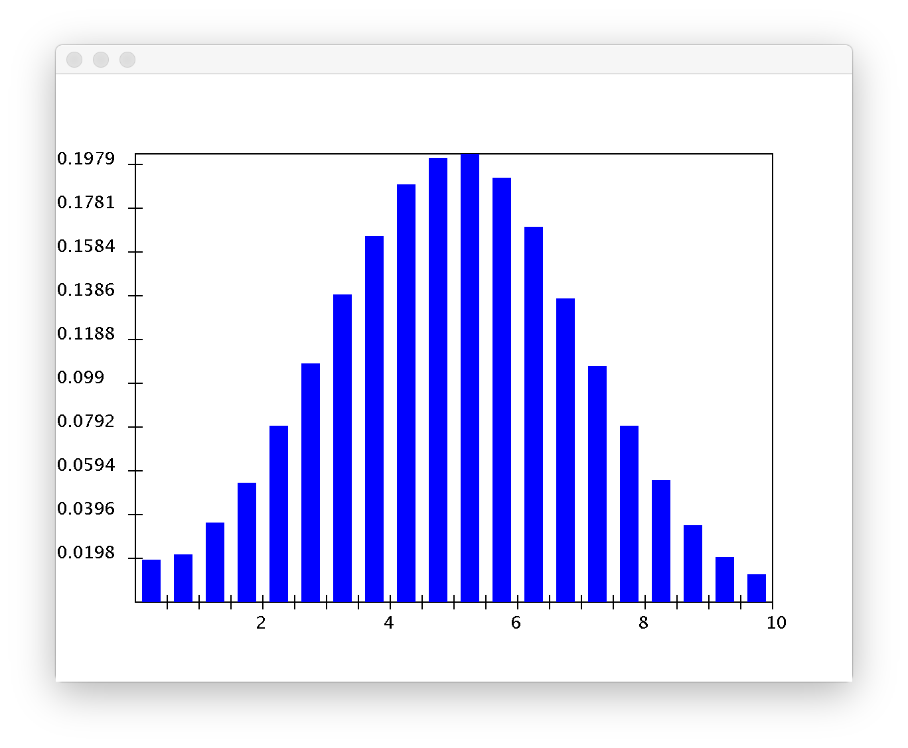

### Module 8 Exercises | Joshua Shapiro | 15 June 2017

3. CODE: Suppose that X $\sim$ Uniform(0,1) and g(X) = $X^2$. Modify UniformExample.java to estimate the pdf of g(X) and its average value. You will also need RandTool.java and DensityHistogram.java What do you notice about the average value of g(X) compared with the average value of X?

* **The average value of x is 0.5000630164767703. The average value of g(X) is 0.33308660577988347. It seems like the average value of g(X) is relatively close to the average value of x squared. Below is the pdf.**
* ****

6. CODE: Suppose X $\sim$ Uniform(0,1) and g(X) is the function g(X) = $(x-0.5)^2$. Work out E[g(X)] by hand. Then estimate the average value of the rv g(X) by adding code to UniformExample4.java.

* **To calculate the expected value by hand...**
    * $E[g(X)] = \int_{-\infty}^{+\infty} g(X)f(X)$
    * $\implies E[g(X)] = \int_{0}^{1} (x-0.5)^2 \frac{1}{1-0}$
    * $\implies E[g(X)] = \int_{-0.5}^{0.5} (u)^2$
    * $\implies E[g(X)] = \frac{u^3}{3}\bigr\rvert^{-0.5}_{0.5}$
    * $\implies E[g(X)] = \frac{1}{12} = 0.0833$
* **The code shows the average value of g(X) to be 0.08302358930311014.**

7. Suppose:
    * X is a rv with range 9, 11 and pmf Pr[X = 9] = 0.5, Pr[X = 11] = 0.5
    * Y is a rv with range 8, 12 and pmf Pr[Y = 8] = 0.5, Pr[Y = 12] = 0.5
    * Z is a rv with range 8, 10, 12 and pmf Pr[Z = 8] = 0.1, Pr[Z = 10] = 0.8, Pr[Z = 12] = 0.1
    * Compute var[X], var[Y], var[Z].

* **For X:**
    * $E[X] = \sum_{k} k * Pr[X = k] = 9 * 0.5 + 11 * 0.5 = 10$
    * $g(X) = (X-\mu)^2 = (X-10)^2$
    * $Var[X] = E[g(X)] = \sum_{k} (k-10)^2 * Pr[X = k] = 1 * 0.5 + 1 * 0.5 = 1$

* **For Y:**
    * $E[Y] = \sum_{k} k * Pr[Y = k] = 8 * 0.5 + 12 * 0.5 = 14$
    * $g(Y) = (Y-\mu)^2 = (Y-14)^2$
    * $Var[Y] = E[g(Y)] = \sum_{k} (k-14)^2 * Pr[Y = k] = 36 * 0.5 + 4 * 0.5 = 20$

* **For Z:**
    * $E[Z] = \sum_{k} k * Pr[Z = k] = 8 * 0.1 + 10 * 0.8 + 12 * 0.1 = 10$
    * $g(Z) = (Z-\mu)^2 = (Z-10)^2$
    * $Var[Z] = E[g(Z)] = \sum_{k} (k-10)^2 * Pr[Z = k] = 4 * 0.1 + 0 * 0.8 + 4 * 0.1 = 0.8$

8. CODE: Download and execute PointGeneratorExample.java. You will also need PointGenerator.java and PointDisplay.java. Increase the number of points to 1000. Can you guess the distribution of X? Of Y?

* **X seems to have a uniform distribution.**
* **Y seems to have a gaussian distribution.**
* ****

9. CODE: Download and modify PointGeneratorExample2.java to display density histograms for X and Y.

* **The histogram of X:**
    * ****
* **The histogram of Y:**
    * ****

10. CODE: Download and examine PointGeneratorExample3.java. The first part of the code estimates Pr[Y $\in$ [5,7]]. Add code below to estimate Pr[Y $\in$ [5,7] | X $\in$ [3,4]]. Are these events independent?

* **Pr[Y in [5,7]]: 0.34286**
* **Pr[Y in [5,7] | X in [3,4]]: 0.341532114095291**
* **As these two values are effectively equal, this shows that the events are independent (Pr[A|B] = Pr[A]).**

24. CODE: Execute UniformVarianceExample.java and obtain the two estimates.

* **Mean estimate: 0.5216167255358847**
* **Std-dev estimate: 0.28058637197873465**

26. If $\mu$' = 0.48 and $\sigma$' = 0.27 and obtain the number of samples needed.

* **Answer below:**
    * $n > (\frac{1.96 \sigma'}{0.03 \mu'})^2$
    * $\implies n > (\frac{1.96 * 0.27}{0.03 * 0.48})^2$
    * $\implies n > (\frac{0.05292}{0.0144})^2$
    * $\implies n > 3.675^2 \implies n > 13.5$

27. If $\mu$' = 0.48 and $\sigma$' = 0.27, obtain f when n = 500 samples are used.

* **Answer below:**
    * $f = \frac{1.96 \sigma'}{\sqrt{n} \mu'}$
    * $\implies f = \frac{1.96 * 0.27}{\sqrt{500} * 0.48}$
    * $\implies f = \frac{0.5292}{10.733126292} = 0.0493$

28. Express $\delta$ as a function of $\sigma$' and n.

* **Answer below:**
    * $f = \frac{1.96 \sigma'}{\sqrt{n} \mu'}$
    * $\implies \delta = f * \mu = \frac{1.96 \sigma' \mu}{\sqrt{n} \mu'}$
    * $\implies \delta = \frac{1.96 \sigma' \frac{S_n}{n}}{\sqrt{n} \frac{S_n * n}{N}}$
    * $\implies \delta = \frac{1.96 * \sigma' * N}{\sqrt{n} * n^2}$

29. Code: Use Stats.java to colect statistics about the single-server queue in Queue.java.
    * Estimate the mean interarrival time. How many samples are needed for a 5% (f = 0.05) confidence interval?
    * Estimate the mean time in system. Again, how many samples are needed for a 5% (f = 0.05) confidence interval? Consider that the true mean system time is E[S] = 4.0 when the arrival rate is 0.75 and the service rate is 1.0.
    * Explain why it may be inappropriate to compute confidence intervals when estimating the mean system time.

* **The mean interarrival time is 1.3544762695277544.**
* **For a 5% confidence interval:**
    * $n > (\frac{1.96 * \sqrt{1.912}}{0.05 * 1.354})^2$
    * $\implies n > (\frac{2.710}{0.0677})^2 = 1602.6$
* **The mean time in system is 2.814388534740915.**
* **For a 5% confidence interval:**
    * $n > (\frac{1.96 * \sqrt{8.388}}{0.05 * 2.814})^2$
    * $\implies n > (\frac{5.6766}{0.1407})^2 = 1627.7$
* **It may be inappropriate to compute confidence intervals when estimating the mean system time as the mean system time is dependent on the arrival rate and service rate. So it would only be appropriate to compute a confidence interval of a mean system time given an arrival rate and service rate.**
